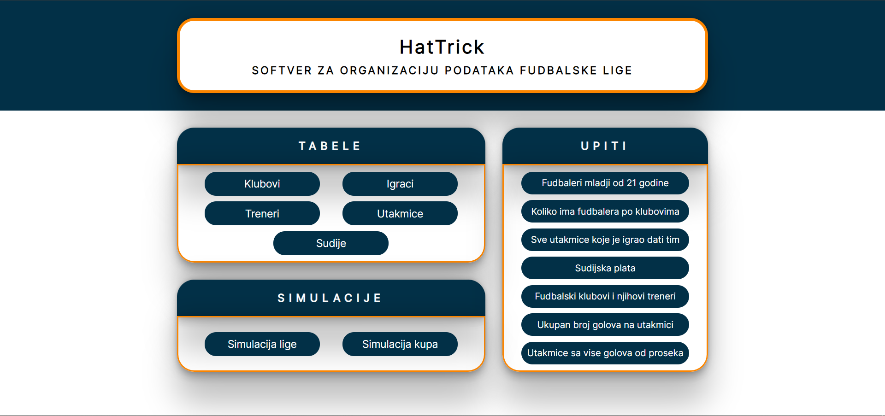
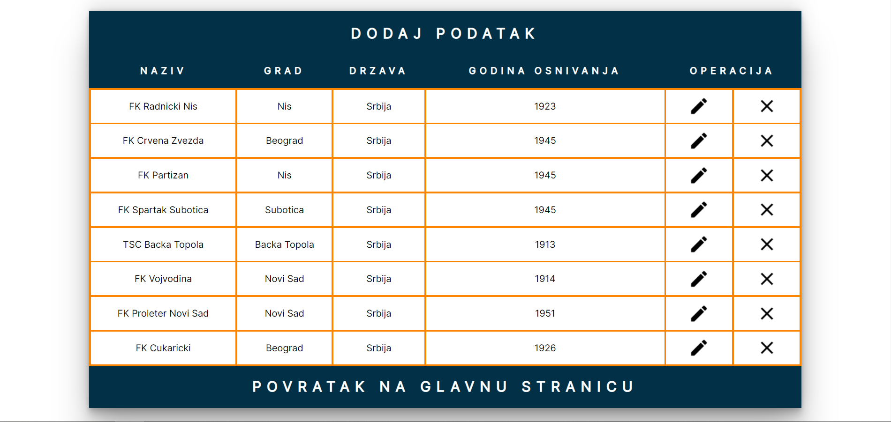
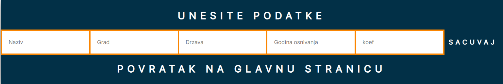
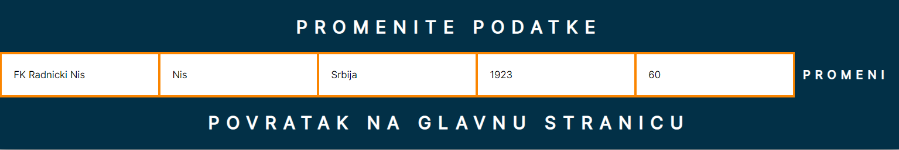
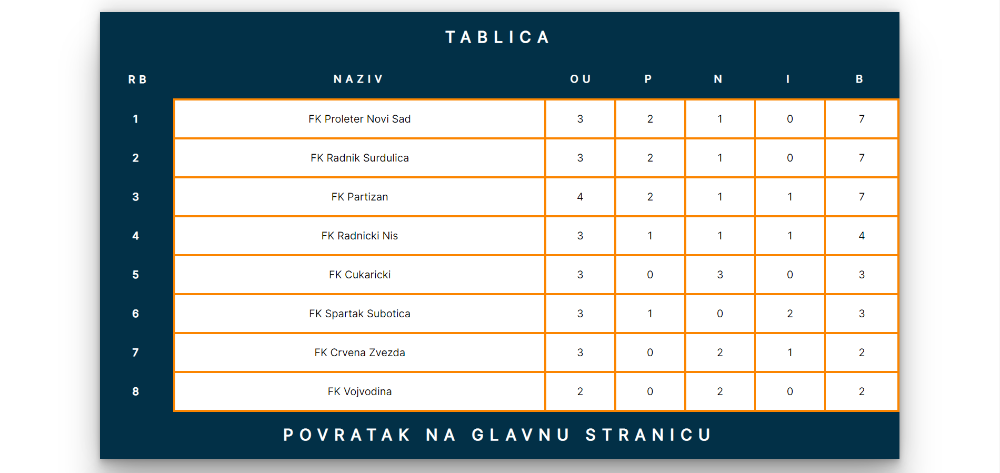
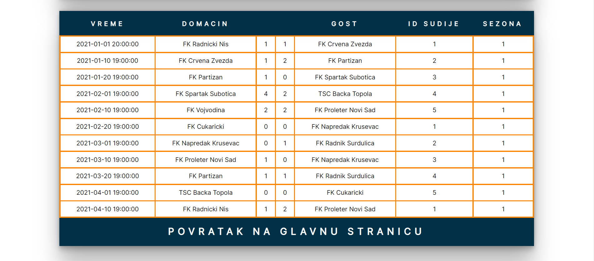

# footballLeague
This project is for my graduation work! ;)

### Home Page
Home Page is based like this so you can access to every information or function in just one or two click. 

### Tables
Category tables present READ operation of our database and this is one example.

### Add/Edit Data
When we want to add new information this is form that we need to fill in, on the other hand when we patch data form is already filled in and we just change content inside box.

### League Simulation
League Simulation presents league standings based on matches played in that season. 

